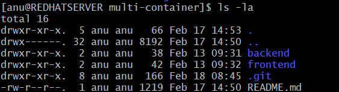
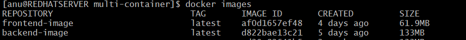

# Multi-Container Docker Project (Frontend + Backend)

This project demonstrates how a simple static frontend (Nginx) communicates with a Python/Flask backend using a custom Docker network.

---

## 📁 Project Structure

```
multi-container/
│
├── backend/
│   ├── app.py
│   └── Dockerfile
│
└── frontend/
    ├── index.html
    └── Dockerfile
```

---

##  How to Run the Project

###  Create a Docker network
```
docker network create mynetwork
```

###  Build the backend image
```
cd backend
docker build -t backend-image .
cd ..
```

###  Run the backend container
```
docker run --network=mynetwork --name backend -d backend-image
```

###  Build the frontend image
```
cd frontend
docker build -t frontend-image .
cd ..
```

###  Run the frontend container
```
docker run -p 8080:80 --network=mynetwork --name frontend -d frontend-image
```

###  Open in browser
```
http://localhost:8080
```

---

##  What I Learned

- How containers communicate inside a custom Docker network  
- Why backend doesn’t need port mapping  
- How frontend calls backend using container DNS  
- How to isolate services cleanly  
- How to rebuild and restart containers properly  


## 📸 Screenshots

### Folder Structure


### Docker Images


### Docker PS -a


